# Interactive and Variable Visualisations of Aggregate Motion
## Depicting Movements of Simulated Flocks
According to Aristotle, the whole is greater than the sum of its parts. 
Craig Reynold's 1986 boids simulation was developed based on the assumption 
made that the overall motion of a flock of organisms in nature could be 
expressed as a cumulation of decisions and behaviours of individual flock 
members themselves. This is a top-down, graphical approach to visualising 
the complex emergent interactions that Reynolds's simple bottom-up solution 
generates. Several modifications and additions are made to the original 
framework, with the intent of emphasising, and heightening appreciation of, 
resultant observable group behaviours.  

### Build Link and Details
Built completely using Unity with C# scripting and deployed using WebGL.  
The system is live and accessible **[here](build.html)**.  

### Flocking
The flocking agents on-screen adhere to a set of eight rules. Three of these
are the original rules from Reynolds's boids simulation (i.e., cohesion, 
alignment, and separation). The rest are additional rules that do not serve
to overrule the original three, but rather work together to rpoduce modified
inetractions between agents and their environment.  

### Summary of Flocking Rules
#### The (Original) Three Rules
1. Cohesion: prevents agents from breaking off from the flock, by
steering each agent towards the average position of its neighbours.
2. Alignment: forces agents to move in the same general direction,
by adjusting each agent's velocity such that it matches the average velocity 
of its neighbours.
3. Separation: states that agents should stay some minimum distance apart to 
avoid collisions, despite the previous two rules bringing them together.  

#### Additional Rules
1. Lifespan: determines how long an agent is alive for, and therefore the 
duration of the current simulation run altogether.
2. Tendency Toward User Interaction Location: Agents are “attracted” to the 
location of the cursor while the user holds down the left mouse button.
3. Environment Retention: Keeps agents within the screen's bounds.
4. Obstacle Avoidance: prevents agents from flying through obstacles placed
by the user within the environment.
5. Speed Limitation: prevents agents from travelling at arbitrarily fast
speeds.  

### Interactivity
Aside from user-defined obstacle placement and making agents flock to the 
user's cursor while the left mouse button is held down, several interactive
and customisable elements are featured:
- the influence of variables and rules can be adjusted using sliders;
- the colour of agent trails can be customised;
- the theme/colour palette of the simulation can be switched; and
- the visibility of placed obstacles can be toggled on/off 

### Results
Screenshots of selected output runs are included here, alongside slider 
values used, where appropriate.  
The experiment was broken up into two parts. In the first, data for each run
consisted of keeping two of the three “original” rules at 100%, with the 
third being set to 0%, to highlight the significance of each rule in its 
absence. This was carried out for lifespans of 5s, 10s, and 20s. This was 
necessary because of the sheer number of possible value combinations. The 
remaining slider values were kept constant at the 50% mark. Obstacles were 
also not used.  
In the second, user testing was carried out with no restrictions, and the 
results were recorded.

<figure>
  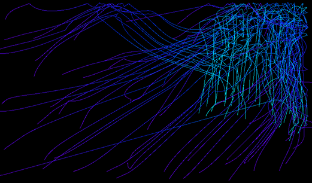
  <figcaption>
    Cohesion = 0, alignment = 1, separation = 1, and lifespan = 5s
  </figcaption>
</figure>  

<figure>
  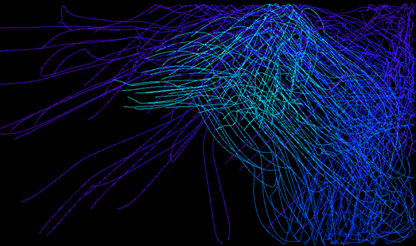
  <figcaption>
    Cohesion = 0, alignment = 1, separation = 1, and lifespan = 10s
  </figcaption>
</figure>  

<figure>
  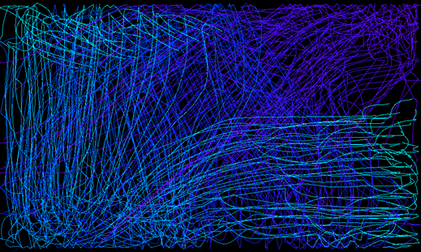
  <figcaption>
    Cohesion = 0, alignment = 1, separation = 1, and lifespan = 20s
  </figcaption>
</figure>  

<figure>
  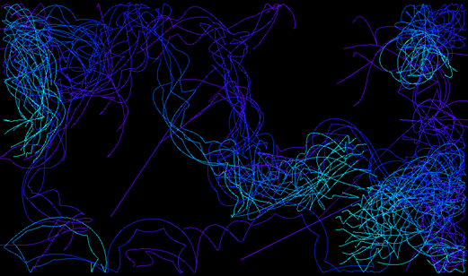
  <figcaption>
    Cohesion = 1, alignment = 0, separation = 1, and lifespan = 5s
  </figcaption>
</figure>  

<figure>
  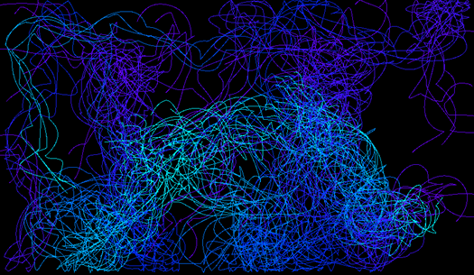
  <figcaption>
    Cohesion = 1, alignment = 0, separation = 1, and lifespan = 10s
  </figcaption>
</figure>  

<figure>
  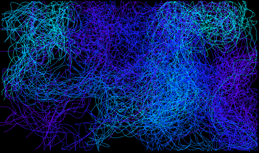
  <figcaption>
    Cohesion = 1, alignment = 0, separation = 1, and lifespan = 20s
  </figcaption>
</figure>  

<figure>
  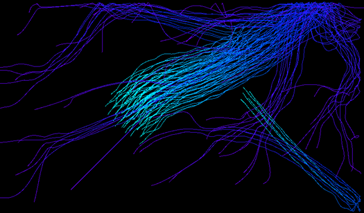
  <figcaption>
    Cohesion = 1, alignment = 1, separation = 0, and lifespan = 5s
  </figcaption>
</figure>  

<figure>
  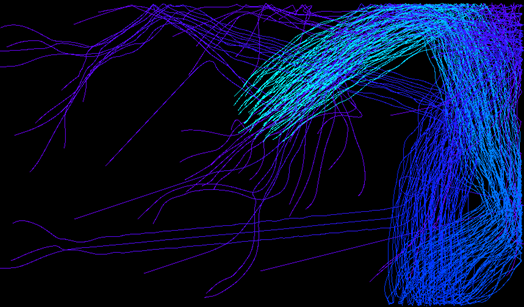
  <figcaption>
    Cohesion = 1, alignment = 1, separation = 0, and lifespan = 10s
  </figcaption>
</figure>  

<figure>
  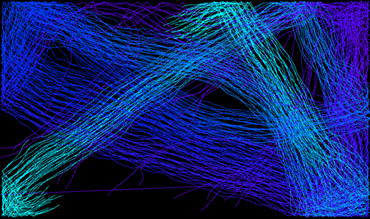
  <figcaption>
    Cohesion = 1, alignment = 1, separation = 0, and lifespan = 20s
  </figcaption>
</figure>  

<figure>
  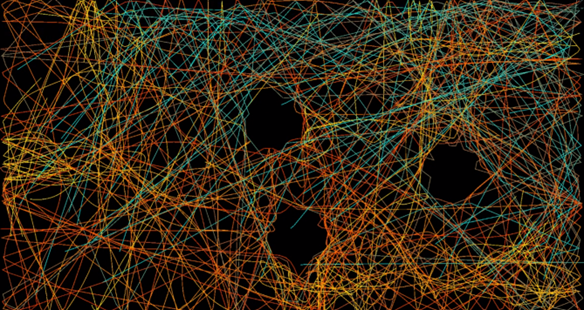
  <figcaption>
  </figcaption>
</figure>  
<figure>
  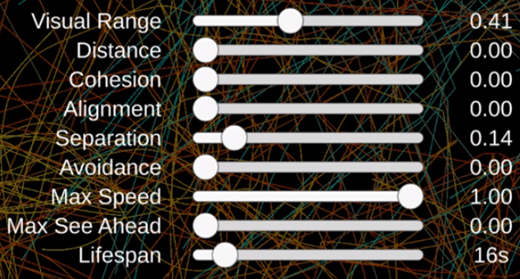
  <figcaption>
    User test 1. Note the placement of the three obstacles.
  </figcaption>
</figure>  
 
<figure>
  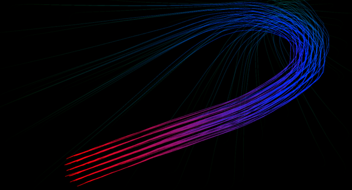
  <figcaption>
    User test 3. 5s lifespan. The left mouse button was clicked on 
    the upper-right corner and dragged, in an arc, down to the 
    lower-right corner.
  </figcaption>
</figure>  

<figure>
  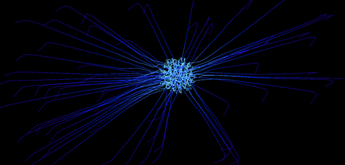
  <figcaption>
    User test 4. 5s lifespan. The left mouse button was clicked and 
    held in the centre of the screen for the entire duration of the 
    simulation run.
  </figcaption>
</figure>  
